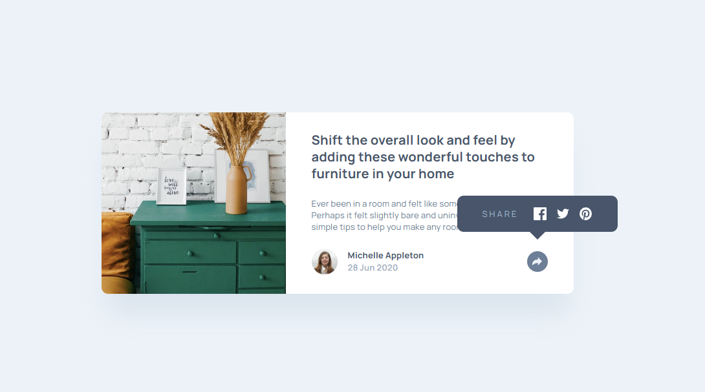

# Frontend Mentor - Article preview component solution

This is a solution to the [Article preview component challenge on Frontend Mentor](https://www.frontendmentor.io/challenges/article-preview-component-dYBN_pYFT). Frontend Mentor challenges help you improve your coding skills by building realistic projects. 

## Table of contents

- [Overview](#overview)
  - [The challenge](#the-challenge)
  - [Screenshot](#screenshot)
  - [Links](#links)
- [My process](#my-process)
  - [Built with](#built-with)
  - [What I learned](#what-i-learned)
  - [Continued development](#continued-development)
- [Author](#author)

**Note: Delete this note and update the table of contents based on what sections you keep.**

## Overview

### The challenge

Users should be able to:

- View the optimal layout for the component depending on their device's screen size
- See the social media share links when they click the share icon

### Screenshot

### Links

- Solution URL: [solution URL](https://github.com/Vilodya/article-preview-component-master)
- Live Site URL: [live site URL](https://vilodya.github.io/article-preview-component-master/)

## My process

### Built with

- Semantic HTML5 markup
- CSS custom properties
- Flexbox
- CSS Grid
- Mobile-first workflow
- [Vue](https://https://vuejs.org/) - JS framework

**Note: These are just examples. Delete this note and replace the list above with your own choices**

### What I learned

It was a very challenging task for me. I decided to use Vue.js here, just to practice on a small project. I spent several days on it, learned a lot, and tried many things. In the end, I gained an understanding of why linters are needed, why we install packages, and so on.

### Continued development

I liked Vue and want to keep using it, and I hope the next projects will go faster.

## Author

- Website - [LinkedIn](https://www.linkedin.com/in/vladimir--denisov)
- Frontend Mentor - [@Vilodya](https://www.frontendmentor.io/profile/Vilodya)
